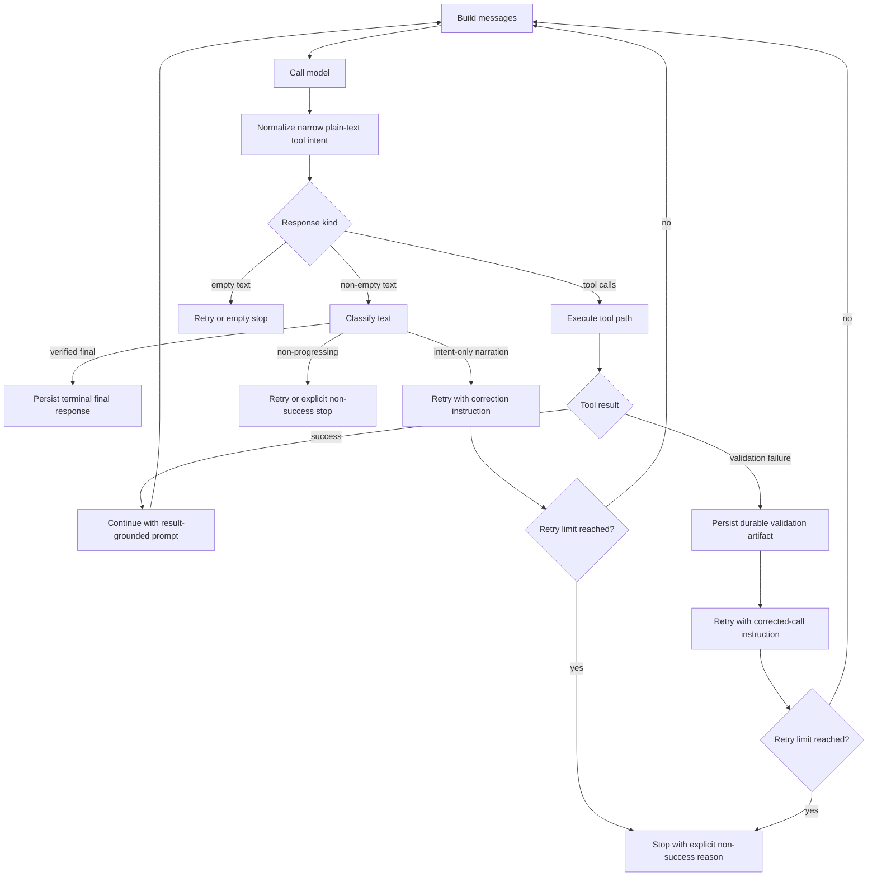

# Architecture Plan: LLM Action Execution Hardening

**Date**: 2026-04-12
**Status**: Implemented
**Requirement**: `.docs/req/2026/04/12/req-llm-action-execution-hardening.md`

## Objective

Harden the generic turn loop so tool-capable turns do not terminate successfully on narrated intent, while preserving:

- real final answers that do not need tools
- narrow existing plain-text tool-intent recovery
- provider purity and host-owned tool execution
- deterministic validation failure handling with bounded recovery

## Current Architecture Summary

- `src/turn-loop.ts` currently treats any non-empty text response as terminal unless it can be normalized into a synthetic tool call through `parsePlainTextToolIntent(...)`.
- `src/tool-validation.ts` already provides deterministic alias and simple type normalization, but validation failures currently return an opaque error string.
- `src/runtime.ts` and the provider modules remain pure model-client boundaries and must stay that way.
- The package turn loop is host-agnostic, so it cannot infer on its own whether a given text response is a verified final answer or a narrated next step. That determination must be policy-driven.

## Proposed Design

### 1. Add explicit response classification to the turn loop

Introduce a package-owned text-classification stage in `src/turn-loop.ts` before terminal completion.

Target classifications:

- `verified_final_response`
- `executable_tool_intent`
- `empty_or_non_progressing`
- `intent_only_narration`

Implementation shape:

- Keep `parsePlainTextToolIntent(...)` as the first bounded conversion path.
- Add a new callback/policy hook so the caller can declare whether the current turn still requires action evidence.
- Add a package helper for future-tense intent-only narration detection that only activates when action evidence is still required.
- Route intent-only narration through a non-terminal path instead of `onTextResponse(...)` terminal completion.

### 2. Make action proof an explicit input to completion

The loop must not assume that non-empty text is sufficient when the caller indicates a tool-capable action turn is still unresolved.

Proposed contract changes:

- Add a caller-owned policy input such as `requiresActionEvidence(...)` or a richer `classifyTextResponse(...)` callback.
- Allow the caller to mark a response as `verified_final_response` only when it is grounded in already executed tool results or when no tool action was actually required.
- Preserve the current simple behavior as the default for non-tool or non-action turns so existing callers do not break.

### 3. Add bounded recovery for narration-only and validation-failure loops

Add explicit retry accounting for two failure classes:

- intent-only narration retries
- validation-failure retries

Behavior:

- When narration-only text appears on an unresolved action turn, continue with a transient instruction that says the model must either emit the tool call now or answer from prior verified results.
- When validation fails, continue with the durable validation artifact and a transient correction instruction.
- After a bounded retry limit, terminate with an explicit non-success reason rather than a false success.

### 4. Standardize durable validation failure artifacts

Keep deterministic normalization in `src/tool-validation.ts`, but replace plain opaque failure strings with a stable artifact envelope.

Artifact requirements:

- identifies the tool name
- identifies the failure category as validation failure
- lists missing, malformed, or disallowed parameters
- lists deterministic corrections that were applied, if any
- is safe to replay back into the conversation as a tool result/error message

This remains bounded:

- known aliases stay supported
- scalar-to-array and numeric string coercion stay supported
- missing required semantic values are still failures
- no free-form argument guessing is introduced

### 5. Keep prompting guidance above the provider boundary

Do not put weak-model execution policy into `src/openai-direct.ts`, `src/anthropic-direct.ts`, or `src/google-direct.ts`.

Instead:

- add reusable turn-loop guidance text for action turns
- make the continuation guidance explicitly forbid narrating future tool actions
- make validation-recovery guidance explicitly require a corrected tool call, not a narrated plan

This keeps providers pure while still meeting the requirement that prompting guidance be explicit.

## Recommended API Shape

The least disruptive design is additive rather than replacing existing callbacks.

Recommended additions in `src/turn-loop.ts`:

- optional text-classification callback or policy object
- optional `onIntentOnlyNarration(...)` callback
- optional retry limits for narration-only and validation-recovery cases
- new terminal reasons for explicit non-success stop states

Recommended additions in `src/types.ts`:

- additive literal unions for the new classification/terminal reasons
- optional structured validation artifact type if exported publicly

Recommended additions in `src/tool-validation.ts`:

- formatter for validation artifacts
- additive metadata in validation results so callers/tests can inspect structured failures

## Flow

## Implementation Plan

### Phase 1: Turn-loop classification and stop reasons

- [x] Add additive text-classification types and terminal reasons in `src/turn-loop.ts` and `src/types.ts`.
- [x] Add a caller-owned policy hook so action-evidence requirements can be evaluated consistently for both initial and continuation turns.
- [x] Add package-owned intent-only narration detection for clear future-action phrasing, gated behind the action-evidence policy.
- [x] Add a non-terminal continuation path for narration-only responses with transient corrective guidance.

### Phase 2: Validation artifact standardization

- [x] Extend `src/tool-validation.ts` to return structured validation outcomes, not just boolean plus string.
- [x] Add a stable validation artifact formatter for built-in and MCP-wrapped tools.
- [x] Preserve existing deterministic alias/type normalization rules and document them in tests.
- [x] Keep missing required semantic values as hard validation failures.

### Phase 3: Bounded recovery behavior

- [x] Add retry counters for narration-only recovery and expose caller-owned validation failure recovery hooks.
- [x] Add explicit stop reasons for bounded recovery exhaustion so failed action turns do not appear successful.
- [x] Ensure the same policy is used on the first model answer and on post-tool continuation answers.

### Phase 4: Prompt guidance and message construction

- [x] Add reusable corrective instruction text for unresolved action turns.
- [x] Add reusable corrective instruction text for validation-failure recovery.
- [x] Keep these instructions in the turn-loop/caller messaging layer, not in provider modules.

### Phase 5: Regression coverage

- [x] Add a direct-turn unit test in `tests/llm/turn-loop.test.ts` showing that text like "I will run the command now" does not complete the turn successfully when action evidence is still required.
- [x] Add a continuation-path unit test in `tests/llm/turn-loop.test.ts` showing that text like "I will inspect the file next" does not complete after a prior tool step when a further action is still unresolved.
- [x] Add validation-artifact coverage in `tests/llm/runtime.test.ts` verifying that missing or malformed required parameters produce a durable validation failure artifact.
- [x] Keep all coverage mocked and in-memory only.

## Tradeoffs

### Option A: Heuristic-only hardening inside `runTurnLoop(...)`

Pros:

- smaller API surface
- quick direct-turn protection for obvious phrases

Cons:

- the loop cannot actually know whether tools are still required
- high false-positive risk for benign future-tense phrasing in ordinary chat

### Option B: Caller-supplied action-evidence policy plus package heuristics

Pros:

- preserves host-agnostic architecture
- consistent direct and continuation behavior
- lets hosts decide when a final answer is truly verified

Cons:

- slightly larger callback surface
- requires small adoption work for hosts using the generic loop

**Recommended**: Option B.

## Architecture Review

### Resolved Issues

- Resolved: The package turn loop cannot infer execution proof by itself. The plan makes proof requirements caller-owned and keeps package heuristics scoped to narration detection only.
- Resolved: Provider purity remains intact. No side-effect logic, transcript persistence, or weak-model policy is pushed into the direct provider modules.
- Resolved: Existing plain-text tool-intent fallback remains bounded. The plan keeps it explicit and deterministic instead of broadening it into free-form argument guessing.

### Remaining Risks And Mitigations

- Risk: Future-tense narration detection can over-block legitimate prose. Mitigation: only apply it when action evidence is still required and expose caller override hooks.
- Risk: New terminal reasons could surprise current callers. Mitigation: make the behavior additive and preserve the existing simple terminal path when no action-evidence policy is enabled.
- Risk: Validation artifacts could diverge across built-in and MCP tools. Mitigation: centralize artifact formatting in `src/tool-validation.ts` and reuse the same wrapper path.

### Review Outcome

No major architecture flaws remain after the adjustments above. This plan is ready for implementation approval.