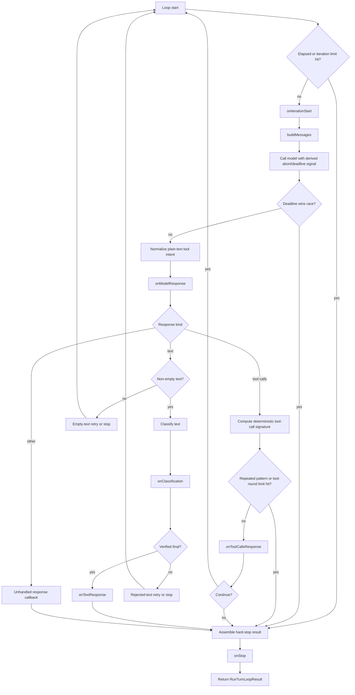

# Architecture Plan: Turn Loop Safety And Lifecycle

**Date**: 2026-04-12
**Status**: Completed
**Requirement**: `.docs/req/2026/04/12/req-turn-loop-safety-lifecycle.md`

## Objective

Strengthen `runTurnLoop(...)` so the package itself owns bounded loop safety, explicit terminal semantics, structured execution traces, lifecycle hooks, and supported cleanup APIs for both explicit environments and cached convenience-path resources.

This plan preserves the current architectural split:

- the runtime owns loop repetition, response normalization, bounded retries, and runtime-owned resources
- the harness still owns state shape, message construction, tool execution policy, persistence, replay, and business-specific completion rules

## Current Architecture Summary

- `src/turn-loop.ts` has bounded empty-text and rejected-text retry handling, but it has no package-owned hard cap for total iterations, consecutive tool rounds, or wall-clock duration.
- `src/turn-loop.ts` converts narrow plain-text tool intent into synthetic tool calls, but the public response surface does not mark those calls as synthetic.
- `src/turn-loop.ts` returns only the final state, retry counts, stop reason, and final response. It does not expose step history, classification history, retry history, or tool-call summaries.
- `src/runtime.ts` supports explicit `LLMEnvironment` injection and cached convenience-path registries, but public cleanup currently relies on direct registry shutdown calls or the test-only `__resetLLMCallCachesForTests()` helper.
- `src/mcp.ts` already has deterministic shutdown semantics for runtime-owned MCP clients, which makes package-level cleanup feasible without redesigning registry internals.
- Built-in tool ownership is documented, but the current docs do not explicitly separate minimal runtime core from optional operational convenience tools.

## Architecture Decisions

### 1. Add intrinsic loop safety with package defaults

`runTurnLoop(...)` should stop safely even when callers do not wrap it in an outer guard.

Recommended additive options:

- `maxIterations`
- `maxConsecutiveToolTurns`
- `maxWallTimeMs`
- `repeatedToolCallGuard`

Recommended default behavior:

- all three hard limits should have non-infinite package defaults so safety is intrinsic rather than opt-in
- defaults should be conservative enough to avoid surprising normal tool flows, but still fail closed on runaway loops
- callers can override limits upward, downward, or disable repeated-call suppression explicitly when they have a justified case

The repeated-call guard should be deterministic and signature-based. The runtime should derive a stable signature from each tool-call response using only data already available in the response surface:

- tool function name
- normalized argument string as emitted by the response
- emitted order within the tool-call batch
- synthetic marker state when enabled

The first implementation should guard consecutive identical tool-call batches, not broad semantic similarity. That is easy to reason about, explain in traces, and keep deterministic under test.

### 2. Enforce timeout through a package-owned deadline signal plus local stop race

Wall-clock timeout must apply to both package-managed model calls and caller-supplied `callModel(...)`.

Design:

- create an internal per-loop deadline controller
- combine the caller abort signal and deadline signal into the signal passed to model invocation
- race model invocation against the deadline so the loop can terminate with `timeout` even if a caller-supplied model path ignores aborts
- document that custom `callModel(...)` implementations should honor the provided abort signal to avoid background work after timeout

This keeps the provider modules pure while still giving the loop an owned timeout boundary.

### 3. Stop repeated tool-call cycles before host tool execution

Repeated-call suppression belongs after response normalization and before `onToolCallsResponse(...)`.

Reasoning:

- if the guard runs only after `onToolCallsResponse(...)`, the host may execute the same tool call again before the loop notices the cycle
- guarding before the callback lets the runtime fail closed on obviously cycling tool batches
- the tool-call summary can still record the attempted repeated batch and the stop reason that prevented execution

This rule applies equally to model-emitted and normalized tool calls.

### 4. Expand the result surface with explicit trace history

`RunTurnLoopResult` should remain a final-result object, but gain additive structured history fields.

Recommended result additions:

- `steps`: one entry per completed iteration with iteration number, elapsed time, response kind, and branch taken
- `toolCalls`: summaries for every encountered tool-call batch and individual call signature details
- `classifications`: classification history for iterations that evaluated text
- `retries`: retry events for empty text, rejected text, and any hard-stop interaction with bounded retries
- `elapsedMs`: total loop runtime
- `stop`: structured terminal metadata, including the stable reason and any guard-specific detail such as repeated signature or exhausted limit

The existing top-level fields should remain:

- `state`
- `response`
- `reason`
- retry counters
- final iteration count

### 5. Add additive lifecycle hooks with fixed ordering

The new hooks should supplement, not replace, the existing branch callbacks.

Recommended additive hooks:

- `onIterationStart(...)`
- `onModelResponse(...)`
- `onClassification(...)`
- `onStop(...)`

Required ordering:

1. safety pre-check for timeout and iteration budget
2. `onIterationStart(...)`
3. `buildMessages(...)`
4. model invocation
5. normalization of synthetic tool intent if enabled
6. `onModelResponse(...)`
7. repeated-tool-call guard for tool responses
8. text classification path and `onClassification(...)` when applicable
9. existing branch callback for tool/text/empty/unhandled handling
10. hard-stop or terminal result assembly
11. `onStop(...)` immediately before returning

That ordering makes traces deterministic and lets callers align loop telemetry with actual branch behavior.

### 6. Mark synthetic tool calls through an opt-in additive flag

Synthetic tool-call marking should remain opt-in to avoid surprising existing callers.

Recommended design:

- add an optional `synthetic?: boolean` flag to `LLMToolCall`
- add a turn-loop option such as `markSyntheticToolCalls?: boolean`
- when enabled and plain-text normalization succeeds, annotate the generated `tool_calls` entries and mirrored `assistantMessage.tool_calls`
- include the same flag in tool-call summary trace entries regardless of whether callers consume the raw response directly

This keeps current normalization behavior stable while making synthetic tool intent inspectable when the caller opts in.

### 7. Add supported cleanup APIs with explicit ownership semantics

Cleanup must cover two cases:

- explicit environments created through `createLLMEnvironment(...)`
- cached convenience-path resources created internally by the runtime

Recommended public API additions:

- `disposeLLMEnvironment(environment)` or equivalent package-owned environment cleanup entrypoint
- `disposeLLMRuntimeCaches()` or equivalent package-owned cleanup for convenience-path caches

Ownership model:

- track resource ownership for environments created by `createLLMEnvironment(...)`
- only dispose registries/resources that were created by the runtime itself
- if a caller injected custom registries into `createLLMEnvironment(...)`, package cleanup should not assume ownership beyond runtime-created wrappers
- cleanup must be idempotent and safe to call multiple times

Implementation note:

- a module-local `WeakMap<LLMEnvironment, OwnershipMetadata>` is the simplest additive way to track what the runtime created without changing the public object shape more than necessary

The test-only reset helper can remain as a test alias temporarily, but production docs and public APIs should point callers to the supported cleanup surface.

### 8. Clarify built-in tool scope as optional operational convenience

The cleanest boundary is:

- minimal runtime core: provider dispatch, turn loop, tool registry composition, MCP integration, skill discovery/loading, environment handling
- optional operational convenience: the current built-in tool catalog

That means the docs should state explicitly that:

- no built-in tool is required for the minimal runtime core to function
- all current built-ins remain package-owned and reserved
- file, shell, web, HITL, and skill-loading built-ins are optional convenience capabilities exposed by the same package surface

This satisfies the scope-clarity requirement without forcing a package split in this change.

## Proposed Type And API Changes

### `src/turn-loop.ts`

- expand `TurnLoopTerminalReason` with:
  - `max_iterations_exceeded`
  - `max_tool_rounds_exceeded`
  - `timeout`
  - `repeated_tool_call_stopped`
- add new trace types for step, tool-call, classification, retry, and stop metadata
- extend `RunTurnLoopOptions` with safety limits, repeated-call guard config, lifecycle hooks, and opt-in synthetic marking
- extend `RunTurnLoopResult` with additive history fields and total elapsed time

### `src/types.ts`

- add optional `synthetic?: boolean` to `LLMToolCall`
- add exported environment cleanup function types if cleanup APIs are exported from the root entrypoint
- add any shared trace-support types that should be part of the public package contract rather than remaining turn-loop-local

### `src/runtime.ts`

- add public cleanup exports for explicit environments and cached runtime resources
- replace direct test reliance on `__resetLLMCallCachesForTests()` with the public cleanup API where possible
- keep internal caches but make their lifecycle package-owned and documented

### `src/index.ts`

- export the new cleanup APIs and any new public turn-loop trace types

### `README.md`

- update the turn-loop section with safety defaults, new stop reasons, lifecycle hooks, synthetic marking, and trace fields
- document the runtime-versus-harness ownership split in one concise table
- document cleanup responsibilities for explicit environments and convenience-path caches
- document built-in core-versus-convenience boundary while preserving reserved-name guarantees

## Flow

## Implementation Plan

### Phase 1: Safety limits and stop semantics

- [x] Add intrinsic hard-limit options and package defaults for max iterations, consecutive tool turns, and wall-clock timeout in `src/turn-loop.ts`.
- [x] Add deterministic repeated-tool-call guard configuration based on consecutive identical tool-call batch signatures.
- [x] Expand terminal stop reasons and result stop metadata so hard-stop paths are machine-readable and distinct from successful or existing bounded-stop paths.
- [x] Ensure hard-stop behavior applies consistently to both `modelRequest` and caller-supplied `callModel(...)` paths.

### Phase 2: Traceability and lifecycle hooks

- [x] Add per-iteration step summaries, tool-call summaries, classification history, retry history, and elapsed timing to `RunTurnLoopResult`.
- [x] Add additive `onIterationStart(...)`, `onModelResponse(...)`, `onClassification(...)`, and `onStop(...)` hooks.
- [x] Fix hook ordering in code and tests so emitted traces align exactly with the runtime’s actual branch order.
- [x] Record enough repeated-call detail in trace entries to explain why a repeated-call guard stopped the loop.

### Phase 3: Synthetic tool-call marking

- [x] Extend the public tool-call surface with an opt-in synthetic marker.
- [x] Annotate normalized plain-text tool intents when the feature flag is enabled, without changing default behavior for existing callers.
- [x] Include synthetic status in trace summaries so normalized and model-emitted tool calls remain distinguishable in debugging output.

### Phase 4: Cleanup and environment lifecycle

- [x] Add a public package cleanup entrypoint for explicit `LLMEnvironment` instances created through the runtime.
- [x] Add a public package cleanup entrypoint for cached convenience-path resources.
- [x] Track runtime-owned resource ownership so cleanup disposes only package-owned registries and cached state.
- [x] Make cleanup idempotent and update tests and e2e harnesses to use the supported public API rather than test-only helpers or direct MCP shutdown where appropriate.

### Phase 5: Documentation and tool-scope clarification

- [x] Update `README.md` to document turn-loop safety defaults, new stop reasons, lifecycle hooks, trace fields, cleanup ownership, and synthetic tool-call behavior.
- [x] Clarify that the minimal runtime core does not require built-in operational tools, while preserving the current package-owned reserved-name boundary for all built-ins.
- [x] Document what the runtime owns versus what the caller still owns for state, persistence, tool execution, message construction, and replay.

### Phase 6: Regression coverage

- [x] Add unit coverage in `tests/llm/turn-loop.test.ts` for `max_iterations_exceeded`.
- [x] Add unit coverage in `tests/llm/turn-loop.test.ts` for `max_tool_rounds_exceeded`.
- [x] Add unit coverage in `tests/llm/turn-loop.test.ts` for `timeout` using deterministic fake timers or a controlled async model stub.
- [x] Add unit coverage in `tests/llm/turn-loop.test.ts` for repeated identical tool-call suppression before host tool execution.
- [x] Add unit coverage in `tests/llm/turn-loop.test.ts` for lifecycle-hook firing order and trace completeness.
- [x] Add runtime cleanup coverage in `tests/llm/runtime.test.ts` and `tests/llm/mcp-runtime.test.ts` for explicit-environment disposal, cache disposal, and idempotent cleanup.
- [x] Update E2E showcase cleanup paths to validate the new supported disposal boundary.

## Tradeoffs

### Option A: Purely configurable limits with no defaults

Pros:

- minimal compatibility risk for existing callers
- no behavior changes unless callers opt in

Cons:

- fails the requirement for intrinsic safety
- still pushes runaway protection back to harness authors

### Option B: Intrinsic defaults with additive overrides

Pros:

- package becomes safe by default
- aligns with the requirement that callers should not need outer guards
- keeps advanced callers in control through explicit overrides

Cons:

- introduces behavior changes for some long-running loops
- requires careful documentation and traceability so stops are easy to diagnose

**Recommended**: Option B.

### Option C: Put cleanup on `LLMEnvironment` directly

Pros:

- intuitive for callers using explicit environments
- keeps lifecycle close to the object being cleaned up

Cons:

- harder to represent ownership cleanly when the environment contains caller-injected registries
- does not naturally cover convenience-path caches created without an explicit environment

### Option D: Export cleanup functions from the runtime boundary

Pros:

- works for both explicit environments and convenience-path caches
- keeps ownership policy package-owned and explicit
- easier to evolve without reshaping the environment object heavily

Cons:

- slightly less discoverable than an instance method if docs are weak

**Recommended**: Option D.

## Architecture Review

### Resolved Issues

- Resolved: Safety must be intrinsic, not merely configurable. The plan now calls for non-infinite package defaults for the new hard limits.
- Resolved: Timeout must apply even to custom `callModel(...)` paths. The design uses a deadline race plus propagated abort signal rather than assuming provider-managed calls only.
- Resolved: Repeated-call suppression must happen before host tool execution. The plan places the guard immediately after response normalization and before `onToolCallsResponse(...)`.
- Resolved: Cleanup must respect ownership boundaries. The plan uses runtime-owned metadata so package cleanup does not incorrectly dispose caller-owned registries.
- Resolved: Built-in tool scope can be clarified without a package split. The docs will define all current built-ins as optional operational convenience while keeping reserved-name guarantees unchanged.

### Remaining Risks And Mitigations

- Risk: Default hard limits may stop legitimate long workflows. Mitigation: choose conservative defaults, expose clear overrides, and return structured stop metadata with trace history.
- Risk: Timeout on a custom `callModel(...)` that ignores abort may leave background work running. Mitigation: race locally to stop the loop, propagate an abort signal, and document that `callModel(...)` should honor it.
- Risk: Trace surfaces could become noisy. Mitigation: keep summaries compact and programmatic rather than embedding full transcript copies.
- Risk: Environment cleanup semantics may confuse callers who inject their own registries. Mitigation: document ownership clearly and only auto-dispose runtime-created resources.

### Review Outcome

No major architecture flaws remained after review. Implementation was completed, the cleanup ownership bug found during code review was fixed before closeout, and the final verification suite passed.