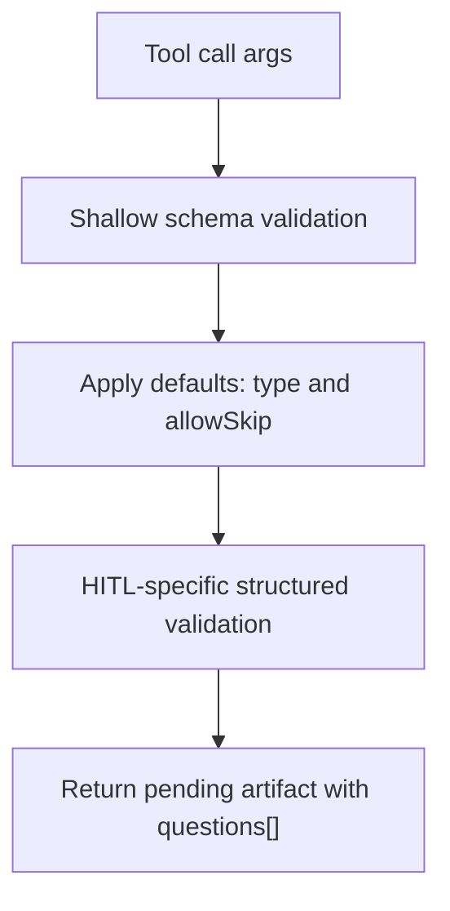

# Plan: Human Input Choice Schema

**Date**: 2026-04-24
**Requirement**: `.docs/reqs/2026/04/24/req-human-input-choice-schema.md`
**Status**: Implemented

## Overview

Update the built-in human-input tool contract for `ask_user_input` and its legacy alias `human_intervention_request` so interactive harnesses can request single-select or multiple-select questions with stable option IDs and optional skip behavior.

The implementation should use the structured `questions[]` shape as the only supported HITL payload shape.

## Current State

- `src/builtins.ts` defines both HITL tool schemas as a flat object with `question`, `options: string[]`, `timeoutMs`, `defaultOption`, and `metadata`.
- `src/builtin-executors.ts` previously produced `PendingHitlToolResult` with flat `question`, `options: string[]`, and `selectedOption: null`.
- `src/types.ts` only models the existing pending artifact.
- `src/tool-validation.ts` provides shallow validation. It does not enforce nested array object constraints, option ID uniqueness, or minimum option counts.
- `README.md` documents tool availability and aliasing but does not document the HITL parameter schema.
- `tests/llm/runtime.test.ts` contains the existing built-in HITL and alias coverage.

## Target Request Shape

```ts
{
  type?: "single-select" | "multiple-select";
  allowSkip?: boolean;
  questions: Array<{
    header: string;
    id: string;
    question: string;
    options: Array<{
      id: string;
      label: string;
      description?: string;
    }>;
  }>;
}
```

## Design

### Public Tool Schema

- Replace the preferred `ask_user_input` JSON schema with the structured `questions[]` shape.
- Keep `human_intervention_request` aligned with the same schema because it is an alias, not an independent contract.
- Do not expose legacy flat `question`, `options`, `defaultOption`, `timeoutMs`, or `metadata` fields in the schema.
- Use `additionalProperties: false`.
- Require `questions` at the top level.

### Strict Shape

- Reject legacy flat calls that use `question`, `options`, `defaultOption`, `timeoutMs`, `metadata`, `prompt`, or `default_option`.
- Default omitted `type` to `"single-select"`.
- Default omitted `allowSkip` to `false`.

### Pending Artifact Shape

Return only structured fields:

```ts
{
  ok: false;
  pending: true;
  status: "pending";
  confirmed: false;
  requestId: string;
  type: "single-select" | "multiple-select";
  allowSkip: boolean;
  questions: Array<{
    header: string;
    id: string;
    question: string;
    options: Array<{
      id: string;
      label: string;
      description?: string;
    }>;
  }>;
}
```

The pending artifact must not include legacy flat fields such as `question`, `options`, `selectedOption`, `defaultOption`, `timeoutMs`, or `metadata`.

### Validation Strategy

Keep generic `validateToolParameters(...)` shallow and add HITL-specific validation in `createHitlExecutor(...)` or a small helper near the executor. This avoids expanding the package validator into a partial JSON-schema engine.

Validation should reject:

- missing or empty `questions`
- missing or empty question `id`, `header`, or `question`
- missing or non-array `options`
- fewer than two options per question for the new structured shape
- empty option `id` or `label`
- duplicate option IDs within a question
- invalid `type`
- non-boolean `allowSkip`

Flat `question` / `options` payloads are invalid. Structured `questions[]` input must enforce at least two options.

Because this package currently returns a pending artifact rather than processing the eventual UI answer, skip behavior should be expressed by carrying `allowSkip` in the artifact. The harness remains responsible for returning an explicit skipped result when the human skips.

### Runtime Flow



## Implementation Tasks

- [x] Update `src/types.ts`
  - [x] Add `HitlSelectionType = "single-select" | "multiple-select"`.
  - [x] Add structured question and option interfaces.
  - [x] Extend `PendingHitlToolResult` with `type`, `allowSkip`, and `questions`.
  - [x] Remove legacy pending fields.
- [x] Update `src/builtins.ts`
  - [x] Update both HITL tool descriptions to mention single-select, multiple-select, and skip behavior.
  - [x] Replace or extend HITL parameter schemas with `type`, `allowSkip`, and `questions[]`.
  - [x] Reject legacy flat fields through the shallow schema.
  - [x] Require `questions` in the shallow tool schema.
- [x] Update `src/tool-validation.ts`
  - [x] Remove HITL alias normalization for legacy flat fields.
  - [x] Let shallow validation reject legacy flat fields before execution.
  - [x] Keep deeper HITL validation out of the generic validator.
- [x] Update `src/builtin-executors.ts`
  - [x] Add helpers to normalize structured HITL input.
  - [x] Add helpers to validate structured questions and options.
  - [x] Return structured pending artifacts from both `ask_user_input` and `human_intervention_request`.
  - [x] Remove old artifact fields.
- [x] Update `README.md`
  - [x] Document the preferred `ask_user_input` schema.
  - [x] Document `type` defaults and selection semantics.
  - [x] Document `allowSkip` behavior and strict structured shape.
- [x] Update `tests/llm/runtime.test.ts`
  - [x] Assert `ask_user_input` exposes the structured schema.
  - [x] Assert omitted `type` returns `single-select`.
  - [x] Assert `multiple-select` is preserved in the pending artifact.
  - [x] Assert `allowSkip: true` is preserved in the pending artifact.
  - [x] Assert duplicate option IDs are rejected for structured questions.
  - [x] Assert legacy flat calls are rejected.
  - [x] Assert both aliases return equivalent structured artifacts.
- [x] Verify
  - [x] Run `npm test`.
  - [x] Run `npm run check`.
  - [x] Run `npm run test:e2e:dry-run`.

## SS Verification

- `npm test` passed: 9 files, 82 tests.
- `npm run check` passed.
- `npm run test:e2e:dry-run` passed with `hitl-strict-schema=ok`.
- `git diff --check` passed.

## Architecture Review

### Review Status

Completed.

### Review Findings

- **Updated: strict schema is intentional.** The tool now requires `questions` and rejects flat `question` / `options` payloads before execution.
- **Resolved: nested validation does not belong in the generic validator yet.** The current validator is intentionally shallow. Adding uniqueness and minimum-count checks there would create a partial JSON-schema engine. The plan keeps HITL-specific nested validation local to the HITL executor path.
- **Accepted scope limit: skip enforcement is harness-owned.** The runtime can expose `allowSkip` in the pending artifact, but it cannot force a UI to allow or disallow skipping because the package does not own the human response adapter.

### Decisions

- The canonical and only supported request shape is `questions[]`.
- Omitted `type` resolves to `"single-select"`.
- Omitted `allowSkip` resolves to `false`.
- Structured `questions[]` input must have at least two options per question.
- Legacy flat input is rejected.
- `ask_user_input` and `human_intervention_request` must continue sharing the same executor behavior and pending artifact shape.

### Residual Risks

- Downstream harnesses that only understand the old flat artifact must be updated before adopting this version.
- If future work adds actual human answer ingestion to this package, it will need a separate answer/result schema for selected IDs and skipped prompts.
