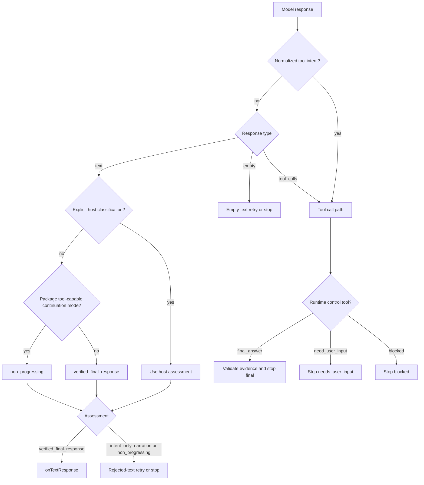

# Architecture Plan: Natural Language Continuation

**Date**: 2026-05-14
**Status**: Implemented
**Requirement**: `.docs/reqs/2026/05/14/req-natural-language-continuation.md`

## Objective

Make `runTurnLoop(...)` continue naturally across languages by owning the default continuation behavior for unresolved tool-capable turns inside the package, instead of depending primarily on English narration patterns or on client-managed continuation logic.

The implementation should preserve the existing guarantee that narrated intent is not treated as executed work, while keeping conversational turns permissive and preserving host overrides for stricter or more domain-specific policy.

The next increment should remove more of the remaining ambiguity in agent mode by introducing explicit runtime control tools for final completion, user-input requests, and blocked outcomes.

## Current Architecture Summary

- `src/turn-loop.ts` already has useful host policy hooks: `requiresActionEvidence(...)`, `classifyTextResponse(...)`, and `onRejectedTextResponse(...)`.
- The current default classification path already rejects unresolved tool-capable text, but it still uses the English narration heuristic to choose the default rejection subtype.
- `parsePlainTextToolIntent(...)` already provides a bounded, deterministic text-to-tool-call normalization path and should remain untouched in spirit.
- Tests in `tests/llm/turn-loop.test.ts` already cover English narration rejection, non-English rejection, mixed-language rejection, and synthetic tool-call normalization.
- The runtime already has `ask_user_input` or `human_intervention_request` style tools for clarification and approval flows, but those are not a complete structural stopping protocol.
- Transcript/UI behavior is host-owned and remains out of scope for this package plan.

Current architecture flaw:

- The remaining gap is protocol-level: even after the recent contract hardening, agent mode still lacks explicit runtime control tools for deterministic `final_answer`, `need_user_input`, and `blocked` outcomes, so the runtime still has to interpret some plain text instead of receiving a structural control signal.

## Proposed Design

### 1. Add a package-owned default continuation mode for tool-capable turns

Keep the current order of evaluation, but introduce a package-owned default text acceptance policy for tool-capable turns.

Proposed behavior:

- If a host supplies `classifyTextResponse(...)`, respect it first.
- If the response can be normalized into a tool call through `parsePlainTextToolIntent(...)`, keep the current tool path.
- If the turn is not running in the package's tool-capable continuation mode, keep the current permissive final-text behavior.
- If the turn is running in the package's tool-capable continuation mode and no explicit final classification was supplied, do not accept unresolved plain text as final by default.

Recommended default classification for that last case:

- use `non_progressing` for the default package-owned rejection path
- keep `intent_only_narration` available only for explicit host classification or legacy heuristics outside the package default acceptance path

This makes the primary correctness rule language-agnostic while preserving the current heuristic as an analytics and recovery-label refinement.

Recommended API direction:

- add an additive package-owned option such as a default text-completion policy or tool-capable continuation mode in `src/turn-loop.ts`
- make `respondWithTools(...)` opt into that safer package-owned default automatically
- keep `runTurnLoop(...)` configurable so advanced hosts can relax or override the default when needed
- do not gate the package-owned default through environment variables; this belongs in code/API behavior, not deployment configuration

### 2. Keep host overrides for truly final text

The package cannot perfectly know whether a text answer is genuinely final in every domain, especially after prior tool results.

So the package should continue to require the host to decide one of these:

- the package default continuation mode should be relaxed for the current turn
- the text is explicitly a `verified_final_response`

The key difference from the prior plan is that these become overrides and refinements, not prerequisites for safe continuation.

### 3. Strengthen bounded recovery defaults

No new retry mechanism is needed, but the default budget should be stronger.

The existing rejected-text retry path already provides:

- bounded retries via `rejectedTextRetryLimit`
- explicit retry accounting
- explicit stop with `rejected_text_response`

This requirement should reuse that path rather than introducing a parallel continuation subsystem, while changing the default retry budget to two retries whenever action evidence is still required.

### 4. Add a runtime-owned agent run loop contract for `respondWithTools(...)`

`buildMessages(...)` remains harness-owned, but `respondWithTools(...)` should wrap it with a package-owned system instruction block.

That block should:

- tell the model it is operating inside an agent run loop
- allow brief progress narration without treating narration as completion
- require the model to call tools when work still needs to be performed
- tell the model that workspace inspection, tool use, file access, search, command execution, and external lookup must go through tools
- stop only through tool calls, evidence-backed final answers, required missing user input, or permission/safety blocks

This keeps the default behavioral contract package-owned while preserving host control of additional system prompts and transcript construction.

Suggested prompt shape:

```text
You are operating inside an agent run loop.

You may briefly tell the user what you are about to do, but narration is not completion.

If the task requires workspace inspection, tool use, file access, search, command execution, or external lookup, you must call the appropriate tool.

For read-only inspection, searching, summarizing, and analysis, proceed without confirmation.

Stop only by:
- calling tools,
- producing a final answer supported by run evidence,
- requesting required missing user input,
- reporting a permission or safety block.

Do not stop after merely announcing intent.
```

### 5. Keep English narration heuristics as a secondary signal only

The existing `INTENT_ONLY_NARRATION_PATTERNS` can remain, but their role should narrow.

They should:

- remain available for legacy or host-specific classification when callers explicitly want that label
- inform recovery guidance and telemetry
- remain optional backward-compatible heuristics

They should not remain the only way that action-dependent unresolved text is rejected.

### 6. Clarify docs and examples around package defaults versus host overrides

The docs should make one point explicit:

- the package owns the safe default continuation behavior for unresolved tool-capable turns
- `requiresActionEvidence(...)` and `classifyTextResponse(...)` are host refinements or overrides, not the only way to get safe continuation
- `classifyTextResponse(...)` is how a host explicitly accepts a final answer when package defaults would otherwise continue or reject

Without that clarification, callers may accidentally over-reject correct final answers or under-protect action-dependent turns.

### 7. Add explicit runtime control tools in agent mode

Add additive internal control tools for agent-mode stopping:

- `final_answer({ answer, evidenceRefs? })`
- `need_user_input({ question, reason })`
- `blocked({ reason })`

Proposed behavior:

- workspace tool call: execute and continue
- `final_answer(...)`: validate any required evidence, then stop as final answer
- `need_user_input(...)`: stop as needs-user-input
- `blocked(...)`: stop as blocked
- bare text in agent mode: treat as protocol-invalid or unresolved and continue with a runtime nudge

This is cleaner than classifying arbitrary natural language for terminal control, while still preserving text-classification compatibility for hosts that have not adopted the structured control protocol yet.

### 8. Preserve compatibility during rollout

The new control tools should be additive.

They should:

- become the preferred deterministic stop path in agent mode
- avoid breaking existing hosts that still use text classification
- keep normal workspace-tool execution semantics unchanged
- preserve `ask_user_input` or `human_intervention_request` for approval or escalation workflows that are distinct from the runtime's structural control outcomes

## Flow



## Implementation Plan

### Phase 1: Inspect relevant files

- [x] Inspect relevant files
  - Review `src/turn-loop.ts` classification order, especially the default text-assessment path.
  - Review the wrapper boundary for `respondWithTools(...)` so a package-owned agent run loop prompt can be injected without changing host state ownership.
  - Review `README.md` examples and hardening guidance for package defaults, `requiresActionEvidence(...)`, and `classifyTextResponse(...)`.
  - Review `tests/llm/turn-loop.test.ts` to identify remaining gaps such as Japanese coverage, classifier override coverage, and tool-call continuation-stop coverage.
  - Inspect where agent-mode tools are defined or injected so runtime-owned control tools can be added without colliding with product tools.

### Phase 2: Make focused changes

- [x] Make focused changes
  - Add additive internal runtime control tools for `final_answer`, `need_user_input`, and `blocked` in agent mode.
  - Define deterministic stop handling for those control tools without changing normal workspace-tool execution behavior.
  - Treat bare text in the structured agent-mode protocol as protocol-invalid or unresolved, and continue with a runtime nudge instead of stopping deterministically.
  - Update the runtime-owned system prompt text to describe the agent run loop and the allowed stop conditions explicitly.
  - Preserve compatibility for hosts that still use text classification or existing human-intervention tools.
  - Update `README.md` so callers understand when to use runtime control tools versus normal workspace tools.

### Phase 3: Run validation

- [x] Run validation
  - Add or update unit coverage for:
    - `final_answer(...)` stopping deterministically as a final answer
    - `need_user_input(...)` stopping deterministically as needs-user-input
    - `blocked(...)` stopping deterministically as blocked
    - bare text in agent mode being treated as protocol-invalid or unresolved instead of terminal final text
    - normal workspace-tool calls still executing and continuing unchanged
  - Run the scoped turn-loop tests and any direct tool/runtime tests touched by the new control-tool plumbing.
  - Run `npm run check` after touching shared runtime behavior.

### Phase 4: Update docs/status

- [x] Update docs/status
  - Reopen the existing requirement and plan to reflect the new structured control-tool requirement.
  - Mark completed plan tasks as implemented only after the new protocol behavior and tests land.
  - Do not create an E2E spec: this remains package-internal protocol behavior and should be covered with deterministic unit tests.

## Tradeoffs

### Option A: Expand multilingual regex detection

Pros:

- small local change
- preserves current mental model

Cons:

- still brittle
- hard to scale across languages and mixed-language responses
- treats language coverage as the core solution when it should only be a heuristic

### Option B: Reject unresolved text by default when action evidence is still required

Pros:

- language-agnostic
- minimal API disruption
- aligns with the existing host-owned action-evidence model
- preserves deterministic behavior

Cons:

- increases reliance on hosts correctly setting `requiresActionEvidence(...)`
- may reject legitimate final text if callers do not explicitly relax or override the policy

### Option C: Package-owned default continuation mode with host overrides

Pros:

- keeps safe continuation working even when the client does nothing special
- language-agnostic by default
- preserves host override hooks for conversational or domain-specific cases
- aligns better with how users expect agent products to continue internally

Cons:

- requires one additive policy concept in the package API
- needs careful compatibility defaults for generic `runTurnLoop(...)`

**Recommended**: Option C.

### Option D: Add explicit runtime control tools for terminal outcomes

Pros:

- makes agent-mode stopping deterministic
- removes reliance on ambiguous plain text for final, blocked, or needs-input outcomes
- composes cleanly with existing workspace-tool execution semantics
- gives the runtime a cleaner protocol boundary than arbitrary natural-language classification

Cons:

- requires additive runtime protocol surface and stop-reason handling
- needs careful compatibility behavior for existing hosts that still depend on text classification

**Recommended next increment**: combine Option C with Option D.

## E2E Coverage Decision

No E2E spec is needed.

This story changes package-internal response classification and retry behavior, not a user-facing browser flow, auth journey, payment path, or cross-system UI path. Deterministic unit coverage is the appropriate verification layer.

## Architecture Review

### Resolved Issues

- Resolved: The requirement does not need a new continuation framework. The existing rejected-text retry path is sufficient once unresolved text is classified correctly.
- Resolved: The package does not need multilingual regex libraries. The stronger design is to reject unresolved action text whenever `requiresActionEvidence(...)` remains true.
- Resolved: Backward compatibility can be preserved by keeping the English narration heuristic as a secondary classification refinement rather than deleting it.
- Resolved: The earlier architecture flaw was real. Safe continuation should not depend on the client wiring the right callbacks. The package must own a default continuation mode for tool-capable turns.
- Resolved: The package can inject a runtime-owned agent run loop prompt at the `respondWithTools(...)` wrapper boundary without taking over host transcript persistence.

### Remaining Risks And Mitigations

- Risk: A package-owned continuation default could surprise permissive `runTurnLoop(...)` callers. Mitigation: make the new policy additive and ensure generic callers can still opt out explicitly.
- Risk: An env-var toggle would make runtime semantics deployment-dependent and harder to reason about. Mitigation: keep the behavior in explicit package defaults and API options only.
- Risk: Hosts may still need to explicitly accept some domain-specific final answers. Mitigation: preserve `classifyTextResponse(...)` as the authoritative override path.
- Risk: `intent_only_narration` telemetry may decrease for package-default rejections because more cases will now land as `non_progressing`. Mitigation: accept that as the correct tradeoff unless a future host wants richer semantic labeling.
- Risk: Injecting a package-owned system prompt could conflict with host-authored system prompts. Mitigation: prepend a stable runtime block while keeping all host-supplied messages intact and documented.

### Review Outcome

No major architecture flaws remain in the existing hardening work, but the next implementation increment is still required. The recommended direction is to keep the delivered language-agnostic continuation contract and add explicit runtime control tools so agent-mode stopping no longer depends on plain-text interpretation.