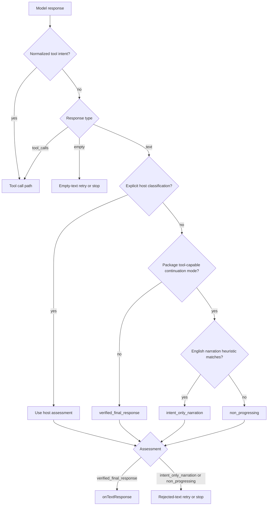

# Architecture Plan: Natural Language Continuation

**Date**: 2026-05-14
**Status**: Implemented
**Requirement**: `.docs/reqs/2026/05/14/req-natural-language-continuation.md`

## Objective

Make `runTurnLoop(...)` continue naturally across languages by owning the default continuation behavior for unresolved tool-capable turns inside the package, instead of depending primarily on English narration patterns or on client-managed continuation logic.

The implementation should preserve the existing guarantee that narrated intent is not treated as executed work, while keeping conversational turns permissive and preserving host overrides for stricter or more domain-specific policy.

## Current Architecture Summary

- `src/turn-loop.ts` already has useful host policy hooks: `requiresActionEvidence(...)`, `classifyTextResponse(...)`, and `onRejectedTextResponse(...)`.
- The current default classification path still treats most non-empty text as `verified_final_response` unless it matches the built-in English narration heuristics.
- `parsePlainTextToolIntent(...)` already provides a bounded, deterministic text-to-tool-call normalization path and should remain untouched in spirit.
- Tests in `tests/llm/turn-loop.test.ts` already cover English narration rejection and synthetic tool-call normalization, but they do not yet cover non-English unresolved text.
- Transcript/UI behavior is host-owned and remains out of scope for this package plan.

Current architecture flaw:

- The prior plan treated `requiresActionEvidence(...)` as the primary continuation gate, which means robust natural continuation still depends on the client making the right policy decision up front. That is too weak for the default package behavior the requirement now calls for.

## Proposed Design

### 1. Add a package-owned default continuation mode for tool-capable turns

Keep the current order of evaluation, but introduce a package-owned default text acceptance policy for tool-capable turns.

Proposed behavior:

- If a host supplies `classifyTextResponse(...)`, respect it first.
- If the response can be normalized into a tool call through `parsePlainTextToolIntent(...)`, keep the current tool path.
- If the turn is not running in the package's tool-capable continuation mode, keep the current permissive final-text behavior.
- If the turn is running in the package's tool-capable continuation mode and no explicit final classification was supplied, do not accept unresolved plain text as final by default.

Recommended default classification for that last case:

- use `intent_only_narration` when the existing English fallback heuristic matches
- otherwise use `non_progressing`

This makes the primary correctness rule language-agnostic while preserving the current heuristic as an analytics and recovery-label refinement.

Recommended API direction:

- add an additive package-owned option such as a default text-completion policy or tool-capable continuation mode in `src/turn-loop.ts`
- make `respondWithTools(...)` opt into that safer package-owned default automatically
- keep `runTurnLoop(...)` configurable so advanced hosts can relax or override the default when needed
- do not gate the package-owned default through environment variables; this belongs in code/API behavior, not deployment configuration

### 2. Keep host overrides for truly final text

The package cannot perfectly know whether a text answer is genuinely final in every domain, especially after prior tool results.

So the package should continue to require the host to decide one of these:

- the package default continuation mode should be relaxed for the current turn
- the text is explicitly a `verified_final_response`

The key difference from the prior plan is that these become overrides and refinements, not prerequisites for safe continuation.

### 3. Preserve bounded recovery and explicit stop reasons

No new retry mechanism is needed.

The existing rejected-text retry path already provides:

- bounded retries via `rejectedTextRetryLimit`
- explicit retry accounting
- explicit stop with `rejected_text_response`

This requirement should reuse that path rather than introducing a parallel continuation subsystem.

### 4. Keep English narration heuristics as a secondary signal only

The existing `INTENT_ONLY_NARRATION_PATTERNS` can remain, but their role should narrow.

They should:

- refine the rejected-text classification to `intent_only_narration` when they match
- inform recovery guidance and telemetry
- remain optional backward-compatible heuristics

They should not remain the only way that action-dependent unresolved text is rejected.

### 5. Clarify docs and examples around package defaults versus host overrides

The docs should make one point explicit:

- the package owns the safe default continuation behavior for unresolved tool-capable turns
- `requiresActionEvidence(...)` and `classifyTextResponse(...)` are host refinements or overrides, not the only way to get safe continuation
- `classifyTextResponse(...)` is how a host explicitly accepts a final answer when package defaults would otherwise continue or reject

Without that clarification, callers may accidentally over-reject correct final answers or under-protect action-dependent turns.

## Flow

## Implementation Plan

### Phase 1: Inspect relevant files

- [x] Inspect relevant files
  - Review `src/turn-loop.ts` classification order, especially the default text-assessment path.
  - Review `README.md` examples and hardening guidance for package defaults, `requiresActionEvidence(...)`, and `classifyTextResponse(...)`.
  - Review `tests/llm/turn-loop.test.ts` to identify where non-English and mixed-language coverage should be added.

### Phase 2: Make focused changes

- [x] Make focused changes
  - Update `src/turn-loop.ts` so unresolved text defaults to rejection when the package-owned tool-capable continuation mode is active, even when the English narration heuristic does not match.
  - Add the smallest additive option needed so the package can own this behavior by default without forcing every current `runTurnLoop(...)` caller into it unintentionally.
  - Do not introduce any env-var-based toggle for this continuation behavior.
  - Keep `INTENT_ONLY_NARRATION_PATTERNS` as a fallback refinement that chooses `intent_only_narration` instead of `non_progressing` when it matches.
  - Avoid adding provider-specific language logic or external language detection.
  - Update `README.md` so callers understand the package default continuation mode and the role of `requiresActionEvidence(...)` and `classifyTextResponse(...)` as overrides.

### Phase 3: Run validation

- [x] Run validation
  - Add or update unit coverage in `tests/llm/turn-loop.test.ts` for at least:
    - a non-English unresolved tool-capable text response
    - a mixed-language unresolved tool-capable text response
    - a conversational or explicitly host-classified final text response that still completes normally
  - Run the scoped unit tests for `tests/llm/turn-loop.test.ts`.
  - Run any fast related runtime tests if needed after touching shared turn-loop behavior.

### Phase 4: Update docs/status

- [x] Update docs/status
  - Mark completed plan tasks as implemented.
  - Update the requirement doc only if implementation reveals stale or ambiguous wording.
  - Do not create an E2E spec: this story is internal turn-loop behavior and should be covered with deterministic unit tests.

## Tradeoffs

### Option A: Expand multilingual regex detection

Pros:

- small local change
- preserves current mental model

Cons:

- still brittle
- hard to scale across languages and mixed-language responses
- treats language coverage as the core solution when it should only be a heuristic

### Option B: Reject unresolved text by default when action evidence is still required

Pros:

- language-agnostic
- minimal API disruption
- aligns with the existing host-owned action-evidence model
- preserves deterministic behavior

Cons:

- increases reliance on hosts correctly setting `requiresActionEvidence(...)`
- may reject legitimate final text if callers do not explicitly relax or override the policy

### Option C: Package-owned default continuation mode with host overrides

Pros:

- keeps safe continuation working even when the client does nothing special
- language-agnostic by default
- preserves host override hooks for conversational or domain-specific cases
- aligns better with how users expect agent products to continue internally

Cons:

- requires one additive policy concept in the package API
- needs careful compatibility defaults for generic `runTurnLoop(...)`

**Recommended**: Option C.

## E2E Coverage Decision

No E2E spec is needed.

This story changes package-internal response classification and retry behavior, not a user-facing browser flow, auth journey, payment path, or cross-system UI path. Deterministic unit coverage is the appropriate verification layer.

## Architecture Review

### Resolved Issues

- Resolved: The requirement does not need a new continuation framework. The existing rejected-text retry path is sufficient once unresolved text is classified correctly.
- Resolved: The package does not need multilingual regex libraries. The stronger design is to reject unresolved action text whenever `requiresActionEvidence(...)` remains true.
- Resolved: Backward compatibility can be preserved by keeping the English narration heuristic as a secondary classification refinement rather than deleting it.
- Resolved: The earlier architecture flaw was real. Safe continuation should not depend on the client wiring the right callbacks. The package must own a default continuation mode for tool-capable turns.

### Remaining Risks And Mitigations

- Risk: A package-owned continuation default could surprise permissive `runTurnLoop(...)` callers. Mitigation: make the new policy additive and ensure generic callers can still opt out explicitly.
- Risk: An env-var toggle would make runtime semantics deployment-dependent and harder to reason about. Mitigation: keep the behavior in explicit package defaults and API options only.
- Risk: Hosts may still need to explicitly accept some domain-specific final answers. Mitigation: preserve `classifyTextResponse(...)` as the authoritative override path.
- Risk: `intent_only_narration` telemetry may decrease for non-English cases because more cases will now land as `non_progressing`. Mitigation: accept that as the correct tradeoff unless a future host wants richer semantic labeling.

### Review Outcome

No major architecture flaws remain after revising the package/client responsibility split. The plan is appropriately scoped, keeps the provider boundary pure, avoids language-specific complexity, and makes safe continuation package-owned by default while preserving host override hooks.