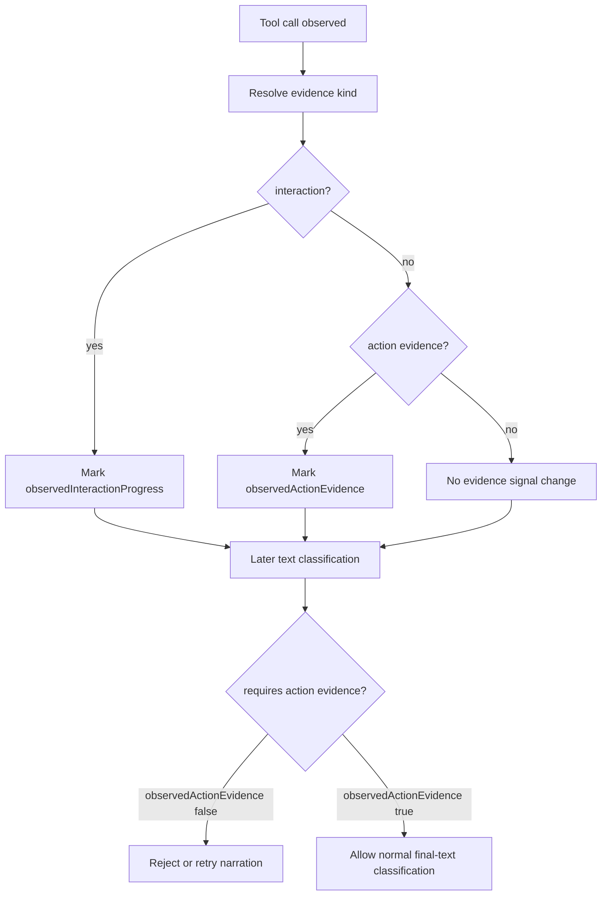

# Architecture Plan: Action Evidence Separation

**Date**: 2026-05-15
**Status**: Implemented
**Requirement**: `.docs/reqs/2026/05/15/req-action-evidence-separation.md`

## Objective

Make `complete(...)` require current-run action evidence rather than generic tool progress, steer the model toward safe broad read-only search before early HITL prompts, and make unsupported result claims fail closed when no action evidence exists.

## Current Architecture Summary

- `src/completion-loop.ts` owns both the loop-level text-response gate and the package-managed bound tool executor used by `complete(...)`.
- The current implementation uses a single `observedRunToolProgress` flag, which is set after any continued tool-call round and after any tool execution through the bound executor.
- That broad signal works for read/write/API tools, but it is too permissive for human-interaction tools because those tools collect input rather than perform task work.
- `src/types.ts` owns the public `LLMToolDefinition` contract and is the right place to add explicit evidence metadata.
- Existing turn-loop coverage already tests unresolved narration before any tool evidence and valid final text after tool usage, so the most natural place for regression coverage is `tests/llm/turn-loop.test.ts`.

## Proposed Design

### 1. Introduce explicit evidence kinds

- Add a public `LLMToolEvidenceKind` union to `src/types.ts`.
- Extend `LLMToolDefinition` with an optional `evidenceKind` field.
- Use a generic default classifier in `src/completion-loop.ts`:
  - Interaction tools: `ask_user_input`, `ask_user_question`, `human_intervention_request`
  - Control tools: `final_answer`, `need_user_input`, `blocked`
  - All other tools: action evidence by default
- When a tool definition explicitly provides `evidenceKind`, prefer that metadata over name-based defaults.

### 2. Split run-scoped signals in `complete(...)`

- Replace `observedRunToolProgress` with `observedInteractionProgress` and `observedActionEvidence`.
- In `complete(...)`, require action evidence by default when `defaultTextResponseMode === 'require_tool_result'` and `observedActionEvidence === false`.
- Continue tracking interaction progress for trace/debug value, but do not let it satisfy final-text acceptance.

### 3. Apply the same classifier to both tool-handling paths

- For normal tool-call responses, inspect the current response batch and mark the appropriate observed signal when the host continues the loop.
- For the package-managed bound executor, classify each executed tool call individually so HITL tools do not accidentally mark action evidence.
- For batched execution, classify each tool call in the batch rather than marking one coarse flag for the whole batch.

### 4. Add prompt and hint gating

- Strengthen `DEFAULT_AGENT_RUN_LOOP_SYSTEM_PROMPT` so read-only search and lookup are explicit tool-first behaviors.
- Strengthen the loop contract so the model is told not to ask the user to disambiguate before a safe broad search.
- Tighten `DEFAULT_HUMAN_INTERVENTION_TOOL_HINT` so HITL is framed as a last resort for required human decisions rather than a substitute for safe search.

### 5. Expose trace metadata

- Extend `TurnLoopToolCallSummary` with `evidenceKind` and `countsAsActionEvidence`.
- Extend `TurnLoopClassificationSummary` with `observedInteractionProgress` and `observedActionEvidence`.
- Populate those fields in existing summaries without changing terminal behavior.

### 6. Add focused regression coverage

- Add a test proving human input alone does not satisfy action evidence.
- Add a test proving unsupported search-result claims are rejected without action evidence.
- Add prompt/hint assertions proving the package guidance prefers safe broad search before `ask_user_input`.
- Add a reusable scripted mock LLM helper and a package-managed Jazz Gill flow regression that exercises retry, interaction, and tool continuation behavior together.
- Add a test proving human input followed by a write/read/custom action tool allows final text.
- Add a test proving the bound executor does not mark `ask_user_input` as action evidence.
- Add a test proving custom executable tools still count as action evidence by default.

## Flow

## Implementation Plan

### Phase 1: Inspect relevant files

- [x] Inspect relevant files
  - Review `src/completion-loop.ts` around `createCompletionToolExecutor(...)`, `complete(...)`, tool-call summaries, and text classifications.
  - Review `src/types.ts` for the public tool definition contract.
  - Review `tests/llm/turn-loop.test.ts` for the best insertion points for the new regression coverage.

### Phase 2: Make focused changes

- [x] Make focused changes
  - Add public tool evidence metadata types.
  - Add generic evidence classification helpers in `src/completion-loop.ts`.
  - Strengthen the loop prompt and human-intervention hint to prefer safe broad read-only search before HITL.
  - Add a default unsupported-evidence classifier for search/read/write/API result claims without action evidence.
  - Split observed interaction progress from observed action evidence in `complete(...)`.
  - Update the bound tool executor to mark evidence by tool kind rather than by generic execution.
  - Extend trace summaries with evidence metadata.
  - Update touched source-file comment blocks.

### Phase 3: Run validation

- [x] Run validation
  - Add focused turn-loop tests for interaction-only narration rejection.
  - Add focused turn-loop tests for unsupported evidence claims without action evidence.
  - Add focused turn-loop tests for unanswered interaction requests stopping without retrying the same question.
  - Add focused turn-loop tests for post-answer retries continuing through a task tool.
  - Add focused prompt/hint assertions for read-only-before-HITL guidance.
  - Add a reusable scripted mock LLM helper plus a package-managed Jazz Gill flow regression.
  - Add focused turn-loop tests for interaction followed by action evidence.
  - Add focused turn-loop tests for bound executor evidence classification.
  - Add focused turn-loop tests for default custom-tool evidence.
  - Verified `tests/llm/turn-loop.test.ts` and `tests/llm/runtime-provider.test.ts`: 62 passing tests.
  - Verified full `tests/llm` unit suite: 137 passing tests.
  - Verified `npm run check`.
  - Verified `npm run build`.

### Phase 4: Update docs/status

- [x] Update docs/status
  - Updated the REQ acceptance checkboxes after implementation passed.
  - Marked this plan implemented with actual validation results.
  - Added a done doc when the workflow reached completion.

## E2E Decision

No `.docs/tests/test-action-evidence-separation.md` spec is needed.

Reason: the change is package-internal loop logic with deterministic unit-testable behavior. The regression cases do not depend on live provider behavior, browser state, or cross-system integration.

## Architecture Review

**Result**: Approved.

Review notes:

- The high-risk edge is compatibility for custom tools. Defaulting unknown/custom tools to action evidence preserves the existing package behavior while still fixing the HITL bug.
- The evidence classifier should be generic and additive. Moving immediately to a strict "all tools require metadata" policy would fix the bug but break existing consumers.
- Trace metadata is worth adding now because this class of loop failure is otherwise difficult to diagnose from terminal behavior alone.
- The change should stay localized to the completion loop and public tool typing. Built-in tool registration does not need a larger redesign for this fix.

## Open Questions

- Whether additional runtime helpers should reuse the same evidence classifier outside `complete(...)` can remain a later follow-up if needed.