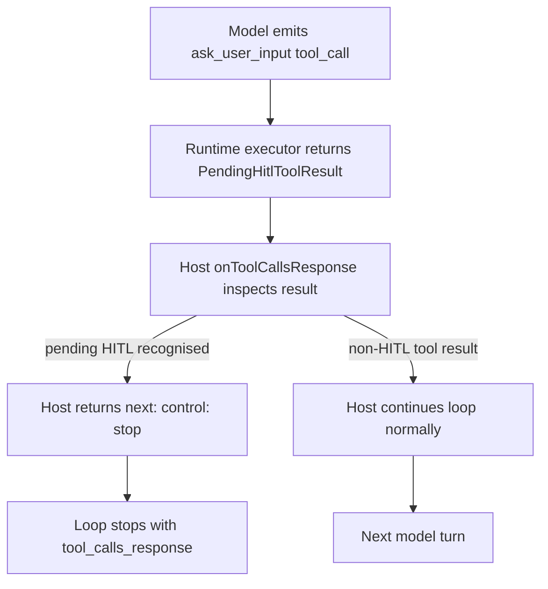

# Architecture Plan: HITL Evidence And Pending Input Suspension

**Date**: 2026-05-15
**Status**: Partially Implemented — only the HITL tool-description tightening shipped; the durable-artifact, acknowledged-evidence, and pending-user-input terminal slices were declined.
**Requirement**: `.docs/reqs/2026/05/15/req-hitl-evidence-pending-input.md`

## Objective

Discourage premature clarification in the HITL path. Originally, the requirement also asked for a trusted suspension artifact, host-acknowledged action evidence, and a dedicated completion-loop terminal for pending user input. Those broader items were evaluated, prototyped in commit `db9380f`, and reverted in commit `d8e6387` because they added ceremony without unlocking a real consumer or fixing a concrete bug. This plan now reflects the surviving scope.

## Current Architecture Summary

- `src/builtins.ts` publishes the preferred `ask_user_input` tool description and two legacy aliases (`human_intervention_request`, `ask_user_question`).
- `src/builtin-executors.ts` returns a `PendingHitlToolResult` with `pending: true`, `status: 'pending'`, `confirmed: false`, `requestId`, `type`, `allowSkip`, and structured `questions[]`. This shape is already distinctive — hosts (for example `ai-workspace/src/runtime/runChatCompletion.ts:170-176`) detect pending HITL by tool name plus `pending === true && status === 'pending'`.
- `src/completion-loop.ts` separates interaction evidence from action evidence via `LLMToolEvidenceKind`. The bound `toolExecutor` records action evidence only when the package executes a tool that is classified as `read`/`write`/`external_action`/`artifact`. Host-owned execution paths follow the same classification.
- Hosts already terminate the loop on pending HITL by returning `next: { control: 'stop' }` from `onToolCallsResponse(...)`.

## Proposed Design

### 1. Tighten HITL tool guidance — accepted

- Update the preferred `ask_user_input` description so it tells the model to use the tool only after safe read-only inspection or lookup cannot supply the missing information, or when the next step requires approval, a user preference, or a human-only decision such as a required confirmation.
- Keep the description clear that real approvals, preferences, and user-only decisions still belong to HITL.
- Reword `human_intervention_request` and `ask_user_question` legacy aliases to carry the same guidance, preserving their compatibility role.
- Add a short README note that mirrors the same guidance for harness authors who only read the README.

### 2. Durable pending-user-input artifact — declined

Rationale: the current `PendingHitlToolResult` shape (`pending: true`, `status: 'pending'`, `confirmed: false`, plus structured fields) is already distinctive. Adding `terminalReason` and `suspended` fields did not unlock a new host capability, and no realistic threat model justifies guarding against "forged" `{ "pending": true }` payloads since the runtime owns the writer of these results and host-owned tool results are the host's responsibility.

### 3. Explicit `acknowledgedEvidence` on `onToolCallsResponse(...)` — declined

Rationale: tool definitions already classify evidence via `evidenceKind`. The bound `toolExecutor` records evidence on successful execution. Requiring every host to opt in with `acknowledgedEvidence: { action: true }` is a breaking ergonomic tax with vanishing real-world value. The previous attempt was reverted in `d8e6387` after producing more developer friction than safety wins.

### 4. Loop-level `pending_user_input` terminal reason — declined

Rationale: hosts already stop the loop deterministically by recognising pending HITL results and returning `next: { control: 'stop' }`. A dedicated runtime terminal duplicates host logic without giving callers anything new.

## Flow

The tool descriptions and the loop-contract system prompt converge on the same guidance: prefer safe read-only inspection or lookup before HITL.

## Implementation Plan

### Phase 1: Inspect relevant files

- [x] Inspect relevant files
  - Reviewed `src/builtins.ts`, `src/builtin-executors.ts`, `src/types.ts`, `src/completion-loop.ts`.
  - Confirmed host integration pattern in `ai-workspace/src/runtime/runChatCompletion.ts` so the description-only change does not break consumers.

### Phase 2: Make focused changes

- [x] Tighten `ask_user_input`, `human_intervention_request`, and `ask_user_question` descriptions in `src/builtins.ts`.
- [x] Add a README note that mirrors the new HITL guidance.
- [x] Update the source-file recent-changes block in `src/builtins.ts`.
- [ ] ~~Extend the pending HITL artifact with terminal-reason/suspended fields.~~ — declined.
- [ ] ~~Add `acknowledgedEvidence` to `onToolCallsResponse(...)`.~~ — declined.
- [ ] ~~Stop the loop on confirmed pending-user-input results with a dedicated terminal.~~ — declined.

### Phase 3: Run validation

- [x] Run validation
  - `npx vitest run` — 138 passing tests, no regressions.
  - `npm run check` — TypeScript clean.

### Phase 4: Update docs/status

- [x] Update docs/status
  - This plan, the matching done doc, and the requirement doc were rewritten to reflect the partial acceptance.

## E2E Decision

No new `.docs/tests/test-hitl-evidence-pending-input.md` spec is needed. The description-only change is observable through the existing unit suite; the declined slices are no longer in the runtime.

## Architecture Review

**Result**: Approved with scope reduction.

Review notes:

- The original design's safety boundary ("trust confirmed tool results, not tool-call intent") is already enforced by `evidenceKind` on tool definitions and the bound `toolExecutor`. Adding a separate acknowledgment mechanism duplicated that without unlocking a new use case.
- A dedicated `pending_user_input` terminal was indistinguishable from the existing host-driven `next: { control: 'stop' }` pattern.
- The description tightening, by contrast, is a high-value, low-risk change: it lands the runtime-side guidance that the loop-contract prompt already carries.

Tradeoffs:

- The runtime keeps the simpler host contract. Hosts that own execution do not need to learn a new acknowledgment field.
- The `PendingHitlToolResult` shape stays unchanged. Hosts continue to detect pending HITL by `pending === true && status === 'pending'` plus tool name.

## Open Questions

None remaining. The declined slices can be reintroduced later if a concrete bug or external consumer demands them.

## Completion Notes

- Tightened HITL tool descriptions for `ask_user_input` and its legacy aliases in `src/builtins.ts`.
- Added a short README note so harness authors get the same guidance.
- Left the `PendingHitlToolResult` shape, the completion-loop terminal set, and the `onToolCallsResponse(...)` contract unchanged.
- Verified with `npx vitest run` (138 passing) and `npm run check` (clean).
- The history is preserved in commits `db9380f` (initial over-engineered implementation) and `d8e6387` (revert that scoped the change down to descriptions only).
