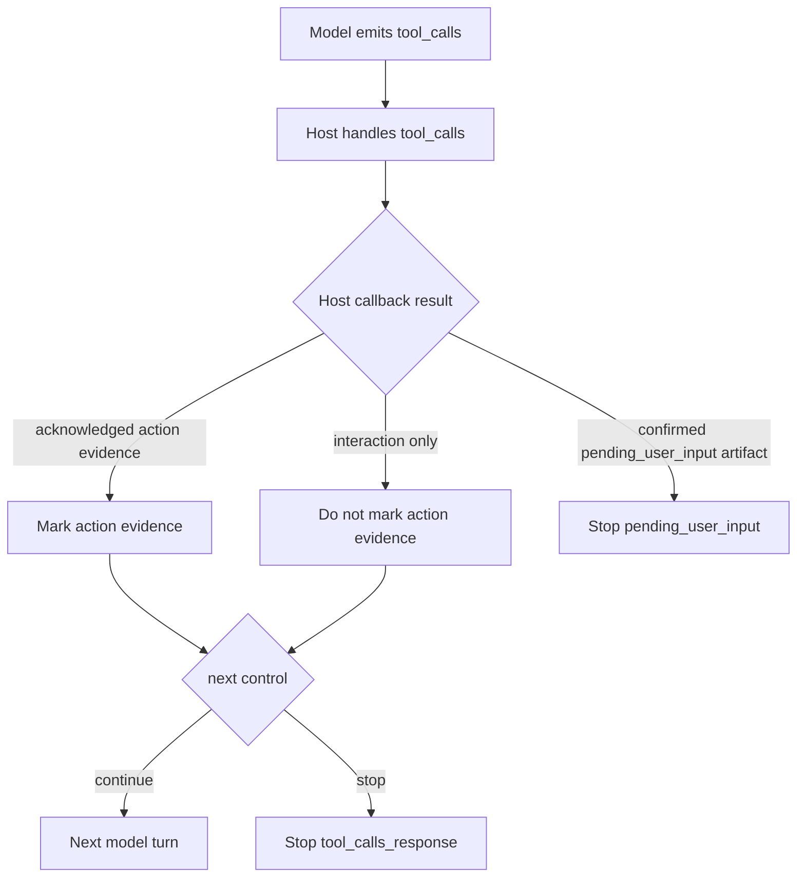

# Architecture Plan: HITL Evidence And Pending Input Suspension

**Date**: 2026-05-15
**Status**: Implemented
**Requirement**: `.docs/reqs/2026/05/15/req-hitl-evidence-pending-input.md`

## Objective

Harden the HITL path so the runtime discourages unnecessary clarification, emits a trusted suspension artifact for pending user input, and requires explicit host acknowledgment before a tool round counts as action evidence.

## Current Architecture Summary

- `src/builtins.ts` publishes the preferred `ask_user_input` tool description and two legacy aliases.
- `src/builtin-executors.ts` normalizes HITL requests and returns a structured `PendingHitlToolResult`, but the artifact only says `pending: true` and `status: 'pending'`.
- `src/completion-loop.ts` distinguishes interaction evidence from action evidence, but `complete(...)` still flips run-scoped action evidence on emitted tool calls before the host callback confirms what actually happened.
- `runCompletionLoop(...)` currently stops on control-tool outputs, while normal tool-call handling depends on `onToolCallsResponse(...)` returning either `continue` or a generic tool-calls stop.
- Existing tests already cover that HITL tools do not count as action evidence by name alone, but they still use generic `{ pending: true }` tool messages in several host callback simulations.

## Proposed Design

### 1. Tighten HITL tool guidance

- Update the preferred `ask_user_input` description so it tells the model to ask only after safe file/search/lookup work cannot resolve the missing information.
- Keep the guidance explicit that real approvals, preferences, and user-only decisions still belong to HITL.
- Reword legacy alias descriptions to stay compatible with the preferred guidance without changing their compatibility role.

### 2. Add a durable pending-user-input artifact

- Extend `PendingHitlToolResult` with a terminal-reason field that identifies the result as pending user input.
- Add an explicit suspension signal such as `suspended: true` so hosts can treat the artifact as a stop condition, not just a hint.
- Preserve `requestId`, `questions`, `type`, `allowSkip`, and existing compatibility fields.
- Keep the artifact machine-readable so the completion loop can recognize only trusted runtime-generated HITL pending results.

### 3. Require explicit action-evidence acknowledgment

- Add an optional acknowledgment field on `onToolCallsResponse(...)`, for example `acknowledgedEvidence`, with an explicit action-evidence variant.
- Continue to infer interaction progress from handled HITL/tool rounds where appropriate, but do not infer action evidence from emitted tool calls alone.
- Update `complete(...)` to mark action evidence only when the host callback explicitly acknowledges it or when a package-owned executor returns a confirmed action artifact.
- Keep the API additive so existing hosts compile without changes.

### 4. Stop the loop on confirmed pending-user-input results

- Inspect handled tool results for the durable HITL pending artifact and stop with a dedicated terminal reason such as `pending_user_input`.
- Only stop this way when the result includes the new trusted reason/suspension fields, not when the transcript merely contains a generic pending JSON object.
- Preserve existing `need_user_input` and `blocked` control-tool terminals.

## Flow

## Implementation Plan

### Phase 1: Inspect relevant files

- [x] Inspect relevant files
  - Review `src/builtins.ts`, `src/builtin-executors.ts`, `src/types.ts`, and `src/completion-loop.ts` for HITL schema, evidence handling, and loop stop paths.
  - Review `tests/llm/runtime.test.ts` and `tests/llm/turn-loop.test.ts` for current HITL and action-evidence coverage.

### Phase 2: Make focused changes

- [x] Make focused changes
  - Update HITL tool descriptions to discourage premature clarification.
  - Extend the pending HITL artifact with an explicit pending-user-input reason and suspension marker.
  - Add additive callback acknowledgment for action evidence on `onToolCallsResponse(...)`.
  - Update completion-loop evidence tracking so emitted tool calls alone do not count as action evidence.
  - Stop the loop on confirmed pending-user-input artifacts without treating generic pending payloads as trusted.
  - Update touched source file comment blocks.

### Phase 3: Run validation

- [x] Run validation
  - Add runtime tests for the updated HITL artifact and description changes.
  - Add completion-loop tests for explicit action-evidence acknowledgment and pending-user-input suspension.
  - Run focused unit tests for touched suites.
  - Run `npm run check` and `npm test` if the focused suites pass cleanly.

### Phase 4: Update docs/status

- [x] Update docs/status
  - Update README HITL guidance and any API notes affected by the new artifact or callback acknowledgment.
  - Mark REQ acceptance criteria and plan phases complete after validation passes.
  - Add a done doc summarizing the change and verification.

## E2E Decision

No new `.docs/tests/test-hitl-evidence-pending-input.md` spec is needed.

Reason: this change is package-internal and deterministically testable with unit coverage in the runtime and completion-loop suites. It does not require a live provider or browser flow to validate.

## Architecture Review

**Result**: Approved with one constraint.

Review notes:

- The key safety boundary is trusting confirmed tool results, not tool-call intent. The implementation should therefore recognize the new pending-user-input stop only from runtime-shaped artifacts, not from arbitrary transcript content.
- The new callback acknowledgment should stay narrowly scoped. A single explicit action-evidence acknowledgment is enough; adding multiple loosely defined booleans would make host behavior harder to reason about.
- Backward compatibility matters here. Existing hosts should still be able to continue a loop without adopting the new field, but they should no longer get implicit action evidence for free.

Tradeoffs:

- Requiring explicit acknowledgment is slightly more work for hosts that own execution, but it prevents false-positive evidence and is the safer default.
- Adding a dedicated pending-user-input reason increases the terminal surface area, but it gives clients a trustworthy suspension state instead of forcing them to infer one from generic JSON.

## Open Questions

- Should the callback acknowledgment field allow future evidence kinds beyond `action`, or should it stay a single explicit action marker until another requirement justifies expansion?

## Completion Notes

- Implemented `pending_user_input` as a real completion-loop terminal reason backed by trusted HITL artifacts instead of generic pending markers.
- Added additive `acknowledgedEvidence` and `pendingUserInput` callback fields so host-managed tool execution can confirm evidence and suspension explicitly.
- Kept package-managed bound executors additive while letting them auto-observe confirmed action evidence and package-owned HITL suspension artifacts.
- Updated runtime and completion-loop unit tests, then verified with the focused suites, the full unit suite, `npm run check`, and `npm run build`.