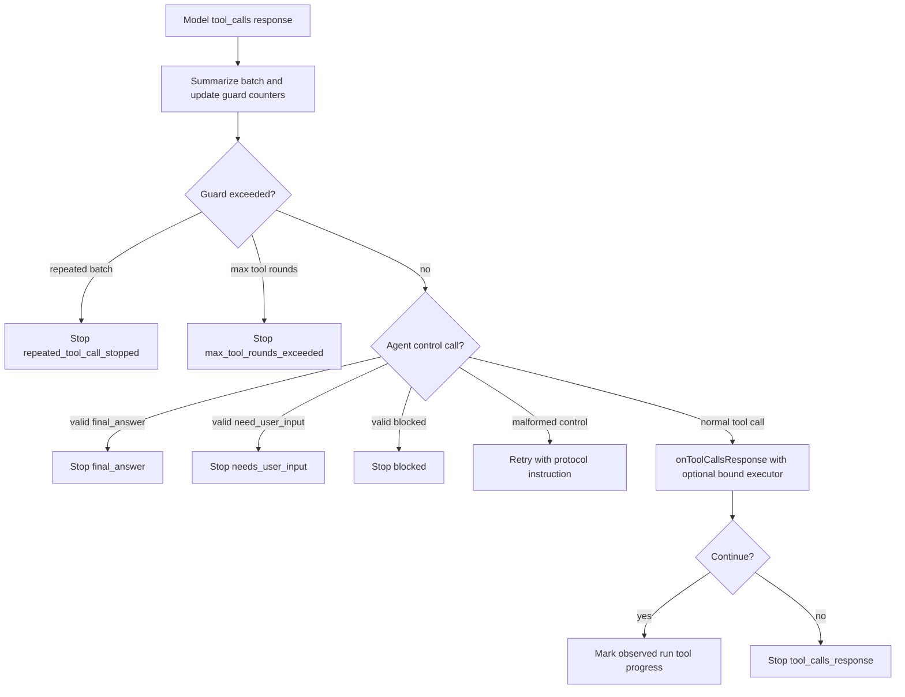

# Architecture Plan: Runtime Hardening Followups

**Date**: 2026-05-15
**Status**: Implemented
**Requirement**: `.docs/reqs/2026/05/15/req-runtime-hardening-followups.md`

## Objective

Close the remaining hardening gaps in the completion loop, provider adapters, and tool-execution helpers while preserving existing public behavior for callers that do not opt into new ergonomics.

## Current Architecture Summary

- `src/completion-loop.ts` owns loop repetition, agent-control handling, response classification, stop metadata, and the preferred `complete(...)` wrapper.
- `complete(...)` currently decides default evidence requirements by comparing the current count of `role: 'tool'` messages against a baseline count captured from the first built message set.
- `src/runtime.ts` owns tool resolution and exposes package-owned `executeToolCall(...)` and `executeToolCalls(...)` helpers, but those helpers currently throw on invalid JSON, unknown tools, and non-executable tool definitions.
- Runtime-facade `complete(...)` binds model invocation to the runtime environment, but `onToolCallsResponse(...)` does not receive an executor bound to the same effective tool surface.
- `src/openai-direct.ts` has provider-facing tool-name translation with reverse mapping. `src/anthropic-direct.ts` and `src/google-direct.ts` still pass runtime tool names directly.
- Focused coverage belongs in `tests/llm/turn-loop.test.ts`, `tests/llm/runtime.test.ts`, and the provider adapter suites.

## Proposed Design

### 1. Guard malformed control-tool retries before retry `continue`

Keep the current valid-control-tool terminal precedence, but move common guard evaluation so malformed control-tool retries cannot bypass repeated-batch and consecutive-tool-turn stops.

Planned behavior:

- Build the tool-call batch summary exactly once for every `tool_calls` response.
- Compute repeated-batch and max-tool-round stop conditions before any protocol-violation retry branch can `continue`.
- For valid single control-tool calls with valid payloads, preserve existing terminal behavior for `final_answer`, `need_user_input`, and `blocked`.
- For malformed control-tool batches or malformed control payloads, first honor guard stops when thresholds are exceeded; otherwise retry with `DEFAULT_AGENT_CONTROL_PROTOCOL_VIOLATION_INSTRUCTION`.

### 2. Track current-run tool evidence independently of message count

Add a run-scoped evidence signal inside the completion path so compacted or rebuilt histories do not make evidence detection depend only on the number of retained tool messages.

Planned behavior:

- Keep `complete(...)` strict before any current-run tool progress has occurred.
- Mark current-run tool progress when `onToolCallsResponse(...)` handles a normal tool-call response and asks the loop to continue.
- Let the package-bound tool executor also mark current-run tool progress after it executes a tool call or returns a recoverable tool-error artifact.
- Continue to allow host classification hooks to override final-text acceptance when they have stronger domain knowledge.
- Avoid requiring append-only transcript history; the next built message set may be compacted, summarized, or rebuilt.

The signal should be named carefully, for example `observedRunToolProgress`, because a callback continuation proves the host treated the tool-call round as handled but may not prove that every host persisted a literal tool-result message.

### 3. Extract provider-safe tool-name translation

Move OpenAI's runtime-name to provider-name translator into a shared helper with provider-specific policy inputs.

Planned behavior:

- Create a small internal helper for sanitizing tool names, avoiding collisions, truncating long provider names, and mapping returned provider names back to runtime names.
- Keep OpenAI-compatible behavior equivalent to the current implementation.
- Use the shared translator in Anthropic tool definition conversion and returned `tool_use` mapping.
- Use the shared translator in Google/Gemini function declaration conversion and returned `functionCall` mapping.
- Apply translation to assistant tool-call history conversion when provider APIs need provider-facing names in replayed messages.
- Use focused tests with dotted names, long names, empty or odd names, and collision-prone pairs.

### 4. Add opt-in recoverable tool-execution artifacts

Keep throwing as the default library behavior, but let agent-loop callers opt into durable error artifacts.

Planned behavior:

- Add a public option such as `errorMode?: 'throw' | 'return-artifact'` to `LLMExecuteToolCallOptions` and `LLMExecuteToolCallsOptions`.
- Add a public artifact shape for tool-execution failures that includes at least `kind`, `toolCallId`, `toolName`, `code`, and `message`.
- Convert invalid JSON arguments, unknown tools, and non-executable tools into that artifact when `errorMode` is `return-artifact`.
- Keep executor-thrown runtime errors throwing by default. Decide during implementation whether `return-artifact` should also catch executor errors; if it does, record the distinction with a specific error code.
- Ensure batch execution uses the same error mode for every tool call and preserves result order.

### 5. Pass a bound tool executor to completion callbacks

Expose a package-owned executor to `onToolCallsResponse(...)` on the package-managed `modelRequest` path so callers do not have to remember the exact per-call tool surface twice.

Planned behavior:

- Add an optional `toolExecutor` field to the `onToolCallsResponse(...)` callback params.
- Bind that executor from the effective `modelRequest` options: `builtIns`, `includeDeprecatedBuiltInAliases`, `extraTools`, direct `tools`, `mcpConfig`, `skillRoots`, and `environment`.
- In runtime-facade `complete(...)`, preserve the existing runtime environment binding before the executor is created.
- Keep `callModel`-only callers unchanged; they can continue to execute tools themselves or ignore the optional executor.
- Make the bound executor use the new recoverable error mode when the caller requests it.

## Flow

## Implementation Plan

### Phase 1: Inspect relevant files

- [x] Inspect relevant files
  - Review `src/completion-loop.ts` around agent-control retry branches, repeated-tool-call guard ordering, and `complete(...)` evidence logic.
  - Review `src/runtime.ts` and `src/types.ts` for the current `executeToolCall(...)`, runtime facade, and tool-resolution option types.
  - Review `src/openai-direct.ts`, `src/anthropic-direct.ts`, and `src/google-direct.ts` for tool definition conversion, assistant tool-call replay, and returned tool-call mapping.
  - Review existing tests in `tests/llm/turn-loop.test.ts`, `tests/llm/runtime.test.ts`, and provider adapter suites to place focused regression coverage.

### Phase 2: Make focused changes

- [x] Make focused changes
  - Reorder or refactor the `tool_calls` branch so malformed control-tool retry paths pass through repeated-call and max-tool-round guard checks.
  - Add current-run tool-progress tracking for `complete(...)` that does not depend only on retained tool-message counts.
  - Add a shared provider tool-name translator and wire it into OpenAI-compatible, Anthropic, and Google adapters.
  - Add opt-in non-throwing tool-execution artifacts to `executeToolCall(...)` and `executeToolCalls(...)` while preserving default throwing behavior.
  - Add an optional bound `toolExecutor` to `onToolCallsResponse(...)` params on package-managed completion paths.
  - Update public types and source file comment blocks for touched source files.

### Phase 3: Run validation

- [x] Run validation
  - Add turn-loop tests for repeated malformed control calls stopping through `repeated_tool_call_stopped`.
  - Add turn-loop tests for malformed changing control calls stopping through `max_tool_rounds_exceeded`.
  - Add completion-loop tests for compacted or rebuilt message histories after current-run tool progress.
  - Add runtime tests for default throwing tool execution and opt-in recoverable artifacts.
  - Add runtime or completion-loop tests proving the bound executor uses the same per-call tool surface as the model request.
  - Add provider adapter tests for Anthropic and Google tool-name round trips, plus shared translator collision and long-name cases.
  - Run focused tests for the touched suites, then run `npm run check`.
  - Verified with focused unit tests, full unit tests, `npm run check`, and `npm run build`.

### Phase 4: Update docs/status

- [x] Update docs/status
  - Updated README snippets for the bound executor and recoverable artifact mode.
  - Updated the REQ acceptance checkboxes after implementation and validation passed.
  - Added a done doc after implementation completed.
  - Deferred the follow-up wiki refresh until this implementation lands in git history, because the wiki ingest workflow reads committed `HEAD` and ignores uncommitted changes.

## E2E Decision

No new `.docs/tests/test-runtime-hardening-followups.md` spec is needed for this plan.

Reason: the requested changes are package-internal loop, adapter, and helper behavior. Deterministic unit tests can cover guard ordering, evidence tracking, non-throwing artifacts, bound executor wiring, and provider request/response mapping without relying on live provider calls. If implementation uncovers provider behavior that cannot be mocked accurately, add a targeted E2E spec then.

## Architecture Review

**Result**: Approved with guardrails.

Review notes:

- The highest-risk design point is evidence tracking. Treating every continued tool-call round as evidence is pragmatic and compatible, but the implementation should avoid naming it as literal persisted tool-result proof unless the bound executor actually observed execution.
- Provider name translation should be internal and policy-driven. Reusing the OpenAI helper blindly could overfit OpenAI's constraints, while duplicating three translators would invite drift.
- The non-throwing execution artifact should be intentionally small and stable. It should not reuse validation artifacts if that would blur schema-validation failures with execution-surface failures.
- The bound executor must be optional and additive. Existing hosts that own execution should not be forced into package-owned execution semantics.
- Guard reordering must preserve valid terminal control-tool precedence. The regression tests should prove both malformed retries and valid terminal stops.

Tradeoffs:

- A callback-return flag such as `observedToolEvidence` would be more explicit than inferring progress from `continue`, but it would add more caller burden. The initial implementation can infer progress for compatibility and reserve an explicit flag for a later refinement if needed.
- A single strict common provider name policy is simpler, but provider-specific policy inputs keep the package flexible if Anthropic or Google constraints differ from OpenAI.
- Returning artifacts for executor-thrown errors is useful for agent loops, but it can hide severe programming mistakes if made the default. Keeping `throw` as the default preserves the current library contract.

## Open Questions

- Should `return-artifact` catch errors thrown by executable tool implementations, or only pre-execution resolution and argument errors?
- Should the bound `toolExecutor` expose a helper for converting results into `role: 'tool'` chat messages, or should it return raw execution results only?
- Should current-run tool-progress tracking be exposed in trace metadata for debugging, or kept as an internal acceptance signal only?