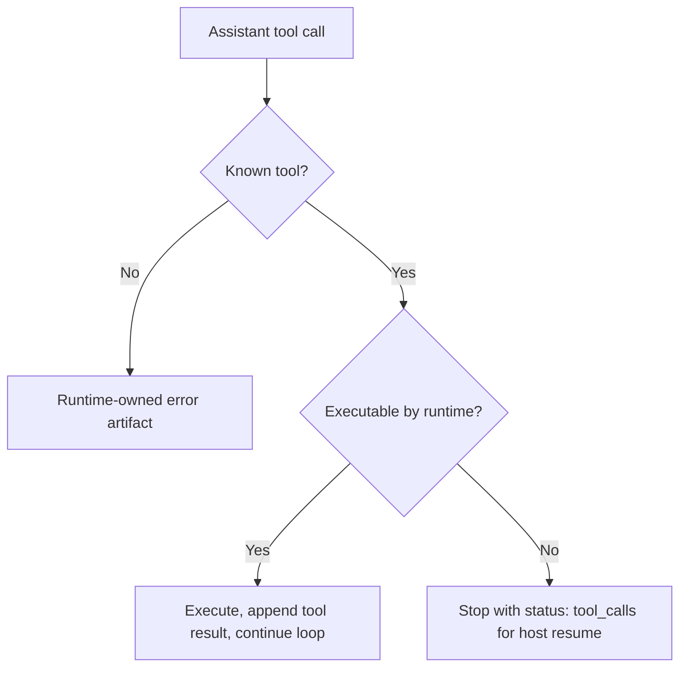

# Plan: Host-Owned Tool Calls

## Tasks

- [x] Inspect relevant files
- [x] Make focused changes
- [x] Run validation
- [x] Update docs/status

## Design

Runtime completion should split tool calls by ownership:

`ask_user_input` stays model-visible as a built-in schema, but because it has no executor it follows the host-owned branch.

## Validation

- Run `npm run check`.
- Run `npm test`.
- Run `npm run test:e2e:host-owned`.
- When live Google credentials are available, run `npm run test:e2e:host-owned:gemini`.

## E2E

Add a local OpenAI-compatible E2E that exercises the public runtime facade without live credentials, plus an optional Gemini 2.5 Flash live-provider path.

## Architecture Review

AR passed: no blocking architecture flaws. The plan preserves the existing loop/executor split, removes the fake human-input executor, and uses the existing `status: "tool_calls"` result shape for host-owned pause/resume.
