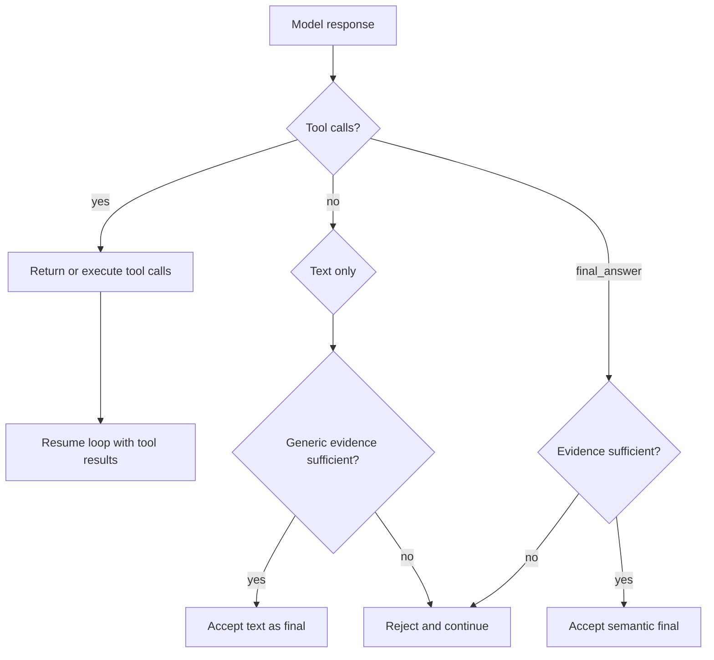

# Plan: Copilot Pattern Runtime

## Scope

Move `llm-runtime` to a hybrid completion model: reliable mechanical loop state plus best-effort semantic `final_answer`.

## Tasks

- [x] Inspect relevant files
- [x] Make focused changes
- [x] Run validation
- [x] Update docs/status

## Design

## Implementation Notes

- Keep `final_answer` as a runtime control tool, but phrase it as preferred protocol.
- Use evidence kinds rather than product-specific checks.
- Keep `ask_user_input` host-owned and resumable.
- Treat successful write, external action, or artifact evidence as enough to accept a no-tool text response after interaction.

## E2E Coverage

No separate E2E spec is needed. This is an internal runtime contract with deterministic unit coverage across `complete()` and `streamComplete()`.
